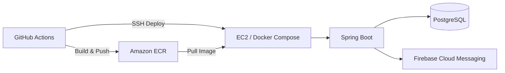

# DueIt Backend

[🌐 Project Homepage](https://turquoise-pulsar-0e3.notion.site/DueIt-1cf4e53559a580ff88d5cf8e807b1923?pvs=74)

집안일과 생활용품을 함께 관리하는 생활 관리 서비스 **DueIt**의 Backend API입니다.

Spring Boot 기반 API 개발부터 Docker 컨테이너화, GitHub Actions, AWS ECR, EC2 배포 환경까지 구성했습니다. 현재는 기존 AWS 인프라를 Terraform 관리 대상으로 전환하고 있습니다.

## Key Features

* 반복 일정 기반 집안일 관리
* 생활용품 재고 관리
* Guest 사용자 등록 및 JWT 인증
* 사용자/그룹 단위 데이터 격리
* FCM 기반 집안일 알림 및 스케줄링

## Architecture



GitHub Actions는 OIDC 기반 AWS 인증을 사용해 ECR에 이미지를 배포합니다.

## Tech Stack

`Java 21` `Spring Boot 3.2.5` `PostgreSQL` `JPA` `JWT` `Firebase Cloud Messaging`

`AWS EC2` `ECR` `Docker` `Docker Compose` `GitHub Actions` `OIDC` `Terraform`

## My Contribution

* GitHub Actions 기반 Docker build, ECR push, EC2 배포 파이프라인 구성
* GitHub OIDC 기반 AWS 인증 적용
* Docker multi-stage build 및 build cache 최적화
* JWT 인증과 사용자/그룹 단위 데이터 접근 제어 구현
* FCM 알림, Push Token 관리, 정기 알림 스케줄러 구현
* 반복 집안일 일정 및 생활용품 재고 관리 API 개발
* 기존 AWS 인프라의 Terraform 전환을 위한 초기 구조와 read-only inventory script 구성

## Terraform Migration

운영 중인 AWS 자원을 새로 생성하지 않고, 기존 인프라를 분석한 뒤 Terraform State로 가져오는 방식으로 전환하고 있습니다.

```text
AWS Inventory → Resource Definition → Import → Plan Verification
```

현재 Terraform 디렉터리 구조와 read-only inventory 수집 단계까지 구성했으며, Remote State와 기존 자원 Import를 진행할 예정입니다.

## Repository Structure

```text
.
├── src/                    # Spring Boot application
├── .github/workflows/      # GitHub Actions CI/CD
├── infra/
│   ├── prod/               # Terraform production configuration
│   └── scripts/            # AWS inventory scripts
├── Dockerfile              # Application container image
└── build.gradle
```
